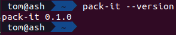

---
hide:
- navigation
---

# Installation

Hop over to the [GitHub releases](https://github.com/Tom-The-Geek/pack-it/releases) and download the latest version for your operating system.
If you are on windows, download `pack-it.exe`, and on linux download `pack-it`. If you are on macOS you need to compile pack-it yourself using `cargo build --release`; this may change in future.

Once you have downloaded the executable, you probably want to place it in a folder that is included in the `PATH` environment variable, for example `~/.local/bin` on linux (might be distribution dependent)

To verify that it works, open a terminal (or command prompt/powershell on Windows) and run `pack-it --version`. If it is working, you should see `pack-it <version>` displayed:

