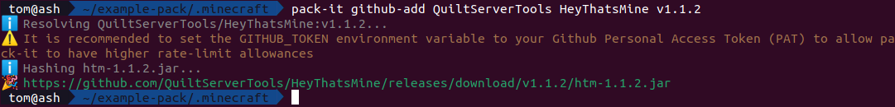

# Basic usage

## Creating a pack
In your terminal, navigate to the location of the `.minecraft` (or whatever your launcher uses) where you want to manage the mods.

pack-it uses a file called `pack.toml` to store the list of mods and the information required to download them,
and so to create an empty `pack.toml`, you can use `pack-it init` and answer the questions it asks:


This will create a `pack.toml` like the following:
```toml
pack_name = "Example Pack"
author = "Tom_The_Geek"
accepted_game_versions = ["1.17"]
mod_loader = "fabric"

[installed_mods]
```

## Adding mods
Once you have a `pack.toml` ready to go, you'll probably want to start adding mods.

!!! info
    pack-it natively supports adding mods from [CurseForge](https://curseforge.com/minecraft/mc-mods), [Modrinth](https://modrinth.com/mods/) and [GitHub releases](https://github.com). To add mods from elsewhere you will have to manually edit the `pack.toml` file.

### CurseForge

To install mods from CurseForge, you can use the command `pack-it curseforge-add <...mod slugs>` like so:


!!! help
    To obtain the slugs of mods you want to add, open the mod's page in your browser, and look at the last part of the mod's URL

    For example, Fabric API's page is [https://www.curseforge.com/minecraft/mc-mods/fabric-api](https://www.curseforge.com/minecraft/mc-mods/fabric-api), and so the slug is `fabric-api`.

### Modrinth

To install mods from Modrinth, you can use the command `pack-it modrinth-add <...mod slugs>` like so:


!!! info
    `pack-it modrinth-add` supports several methods of specifying exactly what you want to add to the pack.

    You can use any of the following forms: `<mod slug>`, `<mod slug>:<version id>`, `<mod id>` or `<mod id>:<version id>`

### GitHub Releases

To install a mod from a GitHub release, you can use `pack-it github-add <owner> <repo> <tag>` like so:



!!! warning
    It is recommended to set the `GITHUB_TOKEN` environment variable to a [GitHub Personal Access Token (PAT)](https://github.com/settings/tokens) in order to avoid pack-it from encountering rate-limiting issues. If you don't do this, pack-it will display a warning when using the `github-add` subcommand.
    
    You can do this on linux like this: `GITHUB_TOKEN=<token goes here> pack-it github-add`.

## Updating mods
```rust
// TODO: Implement this
```

## Removing mods

To remove mods from the pack, you can use `pack-it remove <...mods>` like so:


## Downloading the mods

When running `pack-it *-add`, mod JARs are not automatically downloaded into the `mods/` folder, so in order to trigger a download of any changed mods, you need to run `pack-it download-mods`, which will result in an output like this:


which means that all of your mods will have been magically downloaded!
